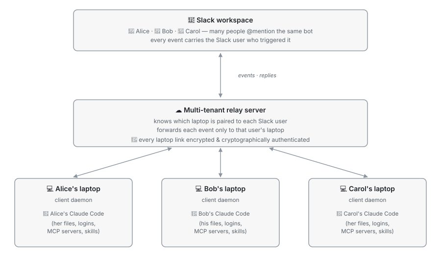
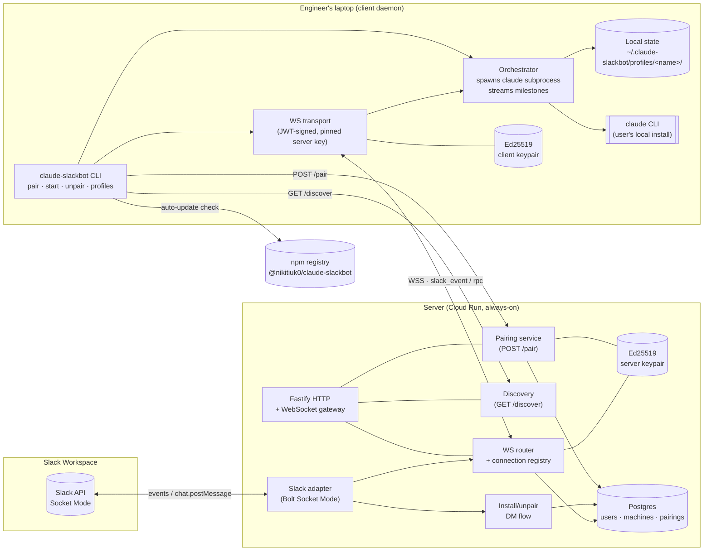
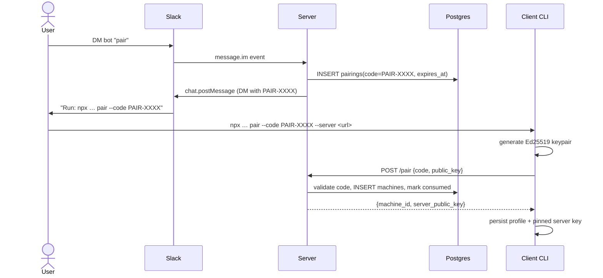
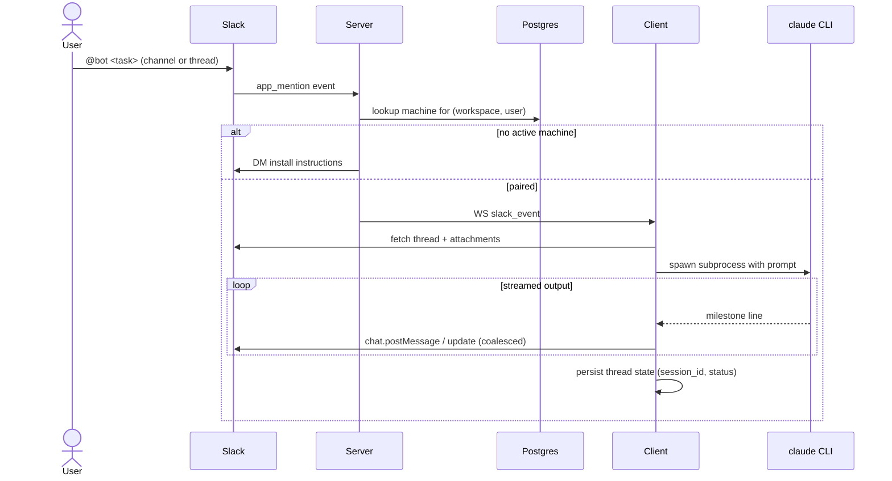

# Architecture

## How it works (the short version)

You **@-mention the bot in Slack** with a task. The task runs on **your own laptop**, using **your own Claude Code** — the same one you use day-to-day. Claude posts progress and results back in the Slack thread.

**Why this design**

- **Your code never leaves your laptop.** The relay only forwards Slack messages back and forth.
- **One bot, many people.** The relay knows which laptop is paired to which Slack user, so your @mention only ever runs on *your* laptop — never anyone else's.
- **Encrypted, authenticated links.** Each laptop pairs once with a code; after that, every connection between the laptop and the relay is encrypted and cryptographically signed, so the relay can only deliver your events to the laptop you actually paired.
- **Same Claude you already have.** Same login, same access, same tools as when you run `claude` at your desk.
- **Works while you're away from your desk** (as long as your laptop is on and connected). Kick off a task from your phone in Slack, come back to the result.

**One-time setup**

1. Install the small daemon on your laptop (`npx @nikitiuk0/claude-slackbot pair …`).
2. The server gives you a short pairing code over Slack DM.
3. Once paired, your laptop stays connected to the relay so the bot knows where to send your tasks.

**What it is not**
- Not a hosted Claude. Anthropic's models are still called, but only from your laptop, just like when you run `claude` locally.
- Not a way for someone else to run code on your machine. Only tasks tied to *your* Slack user reach *your* laptop.
- Not always-on AI roaming your codebase. It only acts when you @-mention it.

---

## For engineers — system overview

The bot is a **two-tier relay**: a small always-on **server** brokers Slack events to one or more **clients** running on engineers' laptops, where the user's local `claude` CLI does the actual work. The server never executes Claude — it only routes events to the right paired machine.

### Components

**External dependencies**
- **Slack** — Socket Mode connection (`xapp-…`) for events; bot token (`xoxb-…`) for posting, reactions, opening DMs
- **Claude Code CLI** — invoked as a subprocess by the client; inherits the user's auth, MCP servers, and skills
- **npm registry** — client checks for updates against `ALLOWED_NPM_PUBLISHER`
- **Postgres** — server-side persistence (local dev: [docker-compose.yml](../docker-compose.yml) on `127.0.0.1:5433`)

## Pairing flow (Phase B)

## Mention / task flow

Stop / nudge / reset commands follow the same path: `app_mention` → server → client, where the orchestrator signals or kills the running subprocess. Thread state stays on disk so a session can be resumed.

## Storage

| Where | What |
|---|---|
| Server Postgres | `users`, `machines` (machine_id, public_key, status, last_seen_at), `pairings` (code, expires_at, consumed_at) |
| Client `~/.claude-slackbot/profiles/<name>/` | `config.json`, `identity/keypair.json`, `identity/machine_id`, pinned server key, `state.json` (per-thread session_id + status), `milestones/<session>.jsonl`, `attachments/<threadTs>/` |

## Auth

- **WebSocket**: client signs a JWT with its Ed25519 private key and presents it on upgrade; server verifies against the public key stored at pair time. JTI cache prevents replay.
- **Pairing endpoint**: short-lived `PAIR-XXXX` code, single use, scoped to one Slack `(workspace, user)`.
- **Server identity**: client pins the server's public key on first pair so a swapped server can't impersonate.
- **Slack**: Socket Mode app-level token + bot token; no per-user Slack OAuth.

---

Key files: [server/src/index.ts](../server/src/index.ts), [server/src/ws/router.ts](../server/src/ws/router.ts), [server/src/db/schema.ts](../server/src/db/schema.ts), [client/src/core/orchestrator.ts](../client/src/core/orchestrator.ts), [client/src/cli/pair.ts](../client/src/cli/pair.ts), [slack-app-manifest.yaml](../slack-app-manifest.yaml), [docker-compose.yml](../docker-compose.yml).
